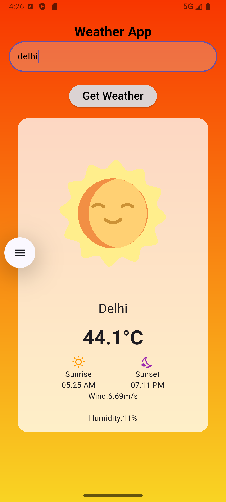
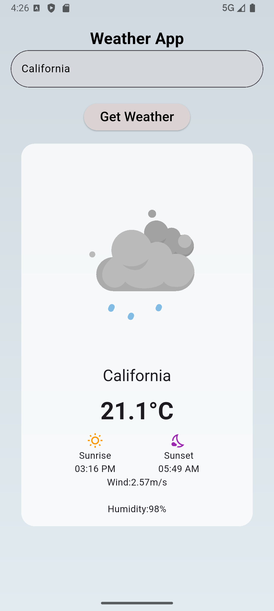

# 🌦️ Weather App

A beautiful Flutter Weather App that allows users to search for any city and get real-time weather information including temperature, humidity, wind speed, sunrise, and sunset timings with animated weather visuals.

Built using Flutter, OpenWeather API, Lottie animations, and clean UI design.

---

## ✨ Features

- 🔍 Search weather by city name
- 🌡️ Real-time temperature display
- 💨 Wind speed information
- 💧 Humidity tracking
- 🌅 Sunrise & Sunset timings
- 🎨 Dynamic gradient backgrounds based on weather conditions
- 🎞️ Lottie weather animations (Sunny, Rainy, Snowy, Cloudy)
- 🔐 API key protection using `.env`

---

## 📱 Screenshots

(Add your screenshots here)

| Screenshot 1 | Screenshot 2 |
|--------------|--------------|
|  |  |

---

## 🛠️ Tech Stack

- Flutter
- Dart
- OpenWeather API
- Lottie Animations
- flutter_dotenv
- HTTP Package

---

## 📂 Project Structure

```bash
lib/
├── models/
│   └── weather_model.dart
├── screens/
│   └── homepage.dart
├── services/
│   └── weather_services.dart
├── widgets/
│   └── weather_card.dart
└── main.dart
```

---

## 🚀 Getting Started

### 1️⃣ Clone the Repository

```bash
git clone https://github.com/your-username/weather_app.git
cd weather_app
```

### 2️⃣ Install Dependencies

```bash
flutter pub get
```

### 3️⃣ Create `.env` File

Create a `.env` file in the root directory and add:

```env
APIKEY=your_api_key_here
ENDPOINT=https://api.openweathermap.org/data/2.5/weather
```

---

## 🔑 Get OpenWeather API Key

1. Visit https://openweathermap.org/api
2. Create an account
3. Generate your free API key
4. Add it to your `.env` file

---

## ▶️ Run the App

```bash
flutter run
```

---

## 📦 Dependencies Used

```yaml
dependencies:
  flutter:
    sdk: flutter
  http:
  flutter_dotenv:
  intl:
  lottie:
```

---

## 📸 App Preview

The app dynamically changes UI and animations according to weather conditions:

- ☀️ Clear Weather → Sunny Animation
- 🌧️ Rain → Rain Animation
- ☁️ Clouds → Cloudy Animation
- ❄️ Snow → Snowfall Animation

---

## 🔒 Environment Variables

This project uses `flutter_dotenv` to keep API keys secure and prevent exposing them on GitHub.

Make sure `.env` is added to `.gitignore`.

Example:

```gitignore
.env
```

---

## 📚 Learning Outcomes

This project helped in learning:

- API Integration in Flutter
- JSON Parsing
- State Management using `setState`
- Async/Await in Dart
- Environment Variables
- Responsive UI Design
- Working with Lottie Animations

---

## 🤝 Contributing

Contributions are welcome!

Feel free to fork the repository and submit a pull request.

---

## ⭐ Show Your Support

If you liked this project, give it a ⭐ on GitHub!

---

## 👩‍💻 Author

Made with ❤️ by Shreya
